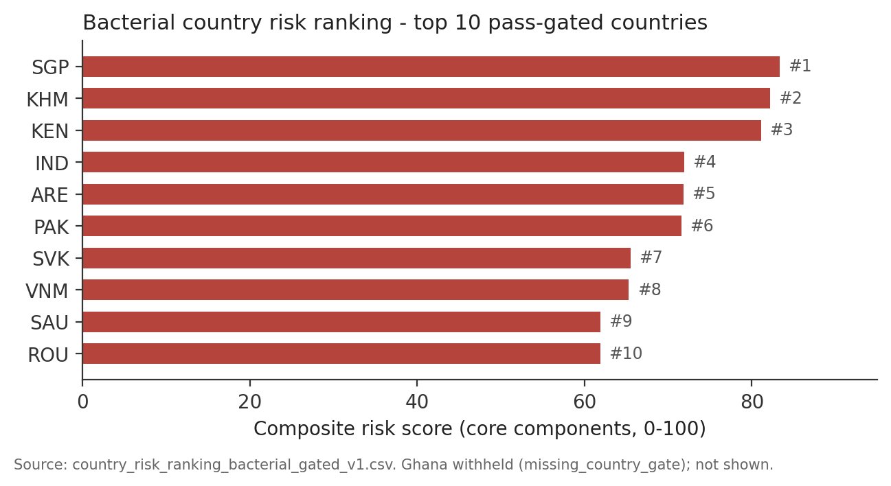
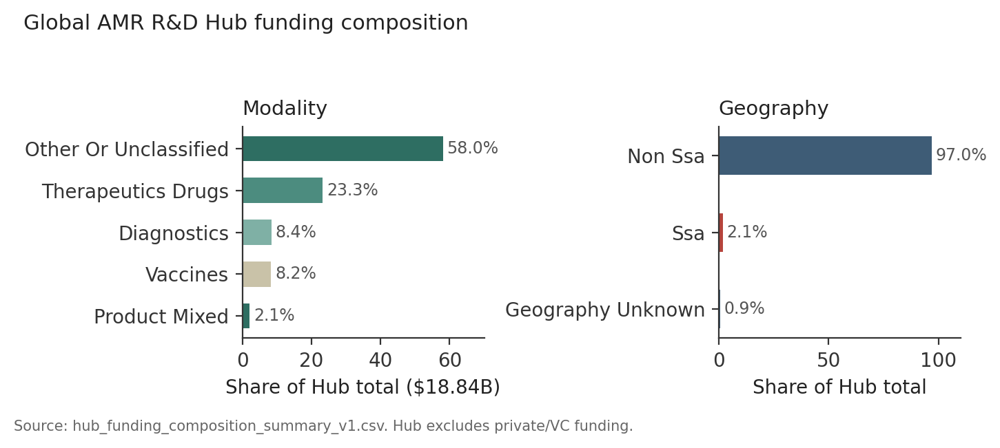

# AMR, Life Expectancy, and Intervention Impact
### Vivli AMR Surveillance Data Challenge 2026 — Final Submission Document

**Open outputs:** https://github.com/enchill-svg/amr-vivli-2026  
**Verified against:** pipeline run `20260720T144743` and `data/published/` (2026-07-20). Every claim cites a published file in that repository.

---

## Abstract

We harmonized four Vivli AMR Register cohorts (three SOAR bacterial surveys and Vivli/SENTRY antifungals) into a **34,787-isolate** registry and a **343,236-row** isolate–drug master table spanning 59 countries. Joining WHO/World Bank life expectancy, health-system indicators, GBD SDI, vaccination, ESAC-Net consumption (Europe), and Global AMR R&D Hub funding, we asked which organism–drug–region patterns co-occur with worse life expectancy, how funding aligns with burden, and which interventions might close the gap. Before any public ranking or policy table is released, an **integrity (evidence) gate** marks each deliverable `pass`, `bounds_only`, or `withhold`. Main results: bacterial cluster and country-risk tables largely clear the gate; fungal country risk and **all 11 intervention recommendations** do not. Fungal life-expectancy association is dominated by GBD SDI (non-causal); the bacterial LE model is too small to support inference. Bacterial Hub funding systematically under-matches surveillance burden. The submission’s open product is a gated pipeline and dashboard that refuse confident numbers the data cannot identify.

---

## Objectives

**Primary objective.** Determine which AMR subtypes (organism–drug–region combinations), characterized by current resistance burden and trajectory of change across bacterial and fungal pathogens, are associated with the lowest life-expectancy outcomes, and estimate the relative impact of candidate interventions on closing that gap.

**Guiding questions.**

1. **Q1** — Which resistance profiles co-occur with the lowest national life expectancy?
2. **Q2** — Does that relationship track antimicrobial overconsumption, weak health-system capacity, low vaccination coverage, or hospital-acquired exposure — and does the answer differ by pathogen type?
3. **Q3** — Where does AMR R&D investment concentrate relative to surveillance burden?
4. **Q4** — Which organism–drug combinations are not yet high-burden but show the steepest trajectory?
5. **Q5** — Which intervention category would plausibly yield the largest life-expectancy gain if scaled?

---

## Methods

**Surveillance data.** SOAR `201818`, `201910`, `207965` (bacterial) and Vivli/SENTRY 2010–2024 (fungal). Harmonized isolate registry: **34,787** records (**34,758** classified: 7,836 bacterial, 26,922 fungal; **29** SOAR `207965` unclassified at organism crosswalk). Master table: **343,236** isolate–drug rows; 59 countries; 61 organisms; 71 drug codes (`dataset_manifest_v1.csv`).

**External joins (ISO3 × year).** WHO/World Bank life expectancy (outcome); ECDC ESAC-Net consumption; WHO/UNICEF Hib3/PCV coverage; World Bank health expenditure and hospital beds; GBD 2023 SDI and LRI comparator; Global AMR R&D Hub funding.

**Pipeline.** Single orchestrator (`analysis/run_all.py`, 30 stages): preprocessing → integrity (identifiability ledger, Manski bounds, ATLAS/PLEA calibration) → analytics (descriptive profiling; MIC trajectory / evolutionary fitness; k-means typology, bacteria k=4 silhouette 0.584, fungi k=2 silhouette 0.847; external join; LE association; Hub alignment; intervention scenarios) → gated deliverables → verification. Seven evidence-gate checks (EG-01–EG-07) and re-validation (J-01–J-07) returned **PASS** (`analysis/scripts/verify_all_figures.py`).

**Integrity gate.** Each public row carries `quality_gate` ∈ {`pass`, `bounds_only`, `withhold`}. Detection-only genotypes are Manski-bounded, never point prevalence. Breakpoint-absent fungal pairs are `unclassifiable`, not dropped (`identifiability_ledger_v1.csv`, 16 categories). A design-based follow-up allocator (`evidence_gate_core/allocator.py`) recommends where fixed MIC budget would resolve uncertainty (PLEA pilot example: pooled prevalence 61.8% [55.1%, 68.5%]; `allocator_recommendations_v1.csv`).

**Association model.** OLS with **country-clustered** SEs of LE on burden, trajectory, health expenditure, beds, SDI, year (± Hib3/PCV and ESAC-Net for bacteria). Explicitly **non-causal** (brief §8).

**Delivery.** Gated CSVs and `dashboard_bundle_v1.json` in `data/published/`; dashboard in `dashboard/` surfaces the same gates (`/countries`, `/policy`, `/methodology`).

---

## Results

**Q1 — Co-occurrence.** Bacterial typology: 640/640 gated rows public — `moderate` 387, `high_trajectory` 92, `high_burden` 92, `high_burden_high_trajectory` 69 (`cluster_typology_bacterial_gated_v1.csv`). Top `high_burden_high_trajectory` examples include *S. pneumoniae*/cefaclor (Slovakia, Cambodia) and *H. influenzae*/trimethoprim-sulfamethoxazole (Morocco). Fungal typology: only **107/1,288** (8.3%) clear the gate. Bacterial country risk: **29/30** pass (Ghana withheld); Singapore, Cambodia, Kenya, India, UAE lead (`country_risk_ranking_bacterial_gated_v1.csv`). Fungal country risk: **0/43** pass (40 `bounds_only`, 3 `withhold`).

**Q2 — Drivers.** Fungal model (n=269 country-years, 36 countries, R²=0.638): GBD SDI dominates (coef 40.7, cluster SE 4.57, p=5.7×10⁻¹⁹); dropping SDI collapses R² to 0.175. Health expenditure and beds are **not** distinguishable from zero under clustered SEs (p=0.173, 0.165) but would appear “significant” under HC1 — a panel-structure lesson, not a data gap. Bacterial primary model (n=16, 5 countries, R²=0.997) is flagged `small_sample_not_for_causal_claims` and supports **no** coefficient claims. Consumption: 21 bacterial Europe-only rows; no antifungal consumption series; no hospital-acquired-exposure dataset (`q2_driver_evidence_summary_v1.csv`).

**Q3 — Funding vs burden.** All four bacterial organisms show burden share ≫ Hub funding share (e.g. *K. pneumoniae* 32.3% vs 1.7%, −30.6pp; *E. coli* 28.4% vs 3.2%) (`funding_gap_summary_v1.csv`). Organism-level Spearman is underpowered (bacterial ρ=0.20, p=0.80, n=4). Portfolio: Hub $18.84B — 23.3% therapeutics, 8.4% diagnostics, 8.2% vaccines, 58.0% other/unclassified; **2.1% SSA** vs 97.0% non-SSA (`hub_funding_composition_summary_v1.csv`; Hub export excludes private/VC).

**Q4 — Steep trajectory, not yet high burden.** Bacterial `high_trajectory`: 92/640; fungal gated: 30/107 — early-action candidates distinct from already dual-high combinations.

**Q5 — Interventions.** **0/11** intervention rows clear the gate (`intervention_recommendations_ranked_gated_v1.csv`; check J-06 `n_pass=0`). PCV/Hib measured coefficients are withheld (small sample / confounding flags); stewardship, diagnostics, WASH/IPC are `data_gap`; R&D is `funding_only_no_le_elasticity`; fungal vaccination `excluded_by_design`. No publishable LE-gain ranking is released.

---

## Impact of the work

1. **Open, gated surveillance product.** Judges and others can inspect methods, CSVs, and UI without raw Register files: https://github.com/enchill-svg/amr-vivli-2026  
2. **Actionable Hub finding.** Bacterial funding–burden mismatch is large, consistent across organisms, and does not depend on fragile LE models — relevant to Global AMR R&D Hub cross-domain reuse.  
3. **SDI dominates explainable fungal LE variance** under correct clustered SEs, arguing for embedding AMR investment in broader development/health-system strategy rather than treating measured AMR burden as a freestanding LE lever.  
4. **Honesty as the policy output.** Withholding all intervention LE ranks is intentional: it maps where the next data investment (antifungal consumption, hospital exposure, larger bacterial LE panels) has highest value — instead of a false confident league table. The pipeline updates when those gaps close.

---

## Tables / figures

**Table 1. Gating summary across published deliverables**  
Sources: `gating_comparison_v1.csv`, `organism_drug_quality_gate_v1.csv`.

| Deliverable | Rows | Pass | Bounds-only | Withhold |
|---|---:|---:|---:|---:|
| Cluster typology — bacterial | 640 | 640 (100%) | 0 | 0 |
| Cluster typology — fungal | 1,288 | 107 (8.3%) | 1,181 | 0 |
| Country risk ranking — bacterial | 30 | 29 (96.7%) | 0 | 1 |
| Country risk ranking — fungal | 43 | 0 (0%) | 40 | 3 |
| Intervention recommendations | 11 | 0 (0%) | 0 | 11 |
| All organism–drug strata | 1,822 | 87 (4.8%) | 713 (39.1%) | 1,022 (56.1%) |

**Figure 1. Bacterial country risk ranking — top pass-gated countries**  
Source: `country_risk_ranking_bacterial_gated_v1.csv`.

**Figure 2. Global AMR R&D Hub funding composition**  
Source: `hub_funding_composition_summary_v1.csv`.

---

## Limitations

Majority of organism–drug strata cannot support a point estimate today (fungal unclassifiable ~20.9% of master rows). Bacterial LE model unusable for inference. Consumption Europe-only; hospital exposure absent. Manifest isolate totals reconciled: 34,758 classified + 29 unclassified = 34,787 (`dataset_manifest_v1.csv`).

---

## References

*(Not counted in Vivli’s 5-page maximum.)*

1. Vivli. *AMR Surveillance Data Challenge — How to Participate.* https://amr.vivli.org/data-challenge/how-to-participate/  
2. Vivli AMR Register. https://amr.vivli.org/  
3. Global AMR R&D Hub. Dynamic Dashboard / investment exports. https://dashboard.globalamrhub.org/  
4. WHO / World Bank. Life expectancy and health-system indicators (country-year series used in joins).  
5. ECDC. ESAC-Net antimicrobial consumption (J01) — Europe.  
6. WHO/UNICEF. Hib3 and PCV immunization coverage estimates.  
7. IHME. Global Burden of Disease 2023 — Socio-demographic Index (SDI).  
8. EUCAST. Clinical breakpoints (v8.1 / v10.0) used for bacterial MIC classification.  
9. CLSI. Antifungal breakpoints / ECVs as applied in fungal classification.  
10. Manski CF. Partial identification / bounds for incomplete data (methodological basis for detection-only genotype reporting).  
11. Akanko E, Enchill-Yawson Y, Boateng W, Ohene Amofa J, Addy HPK. *AMR, Life Expectancy, and Intervention Impact.* 2026 Vivli AMR Surveillance Data Challenge. GitHub: https://github.com/enchill-svg/amr-vivli-2026  

**Team (for Cover Page Form):** Erica Akanko (WACCBIP); Yewku Enchill-Yawson, William Boateng, Justice Ohene Amofa (NMIMR); Humphrey P. K. Addy (KNUST).
